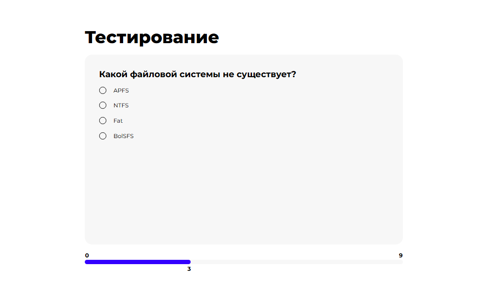
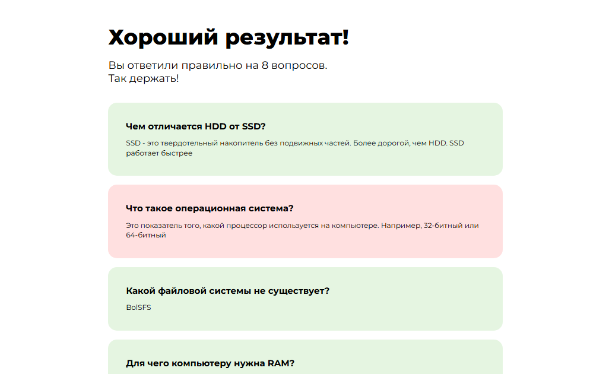

# 📌 App for tests — React.js + TypeScript + Next.js






## 📖 Описание
App for tests — это приложение для прохождения тестов с выбором ответов и отображением результата в конце.
<br></br>
🔹 **Технологии:** 
- Html
- Scss
- React.js
- TypeScript
- Next.js
<br></br>

🔹 **Функционал:** 
- Работа с LocalStorage для начального экрана
- Управление состоянием с useState
- Разделение компонентов
- Подсчет правильных и неправильных ответов в конце теста
- Полоска прогресса, отображающая текущий вопрос
<br></br>
## ✅ Что реализовано / ❌ Чего нет

| Фича         | Статус |
|-------------|--------|
| 🧵 SCSS | ✅ |
| ⚛️ React | ✅ |
| 🚀 Next.js | ✅ |
| 🔷 TypeScript | ✅ |
| 📦 Redux-toolkit | ❌ |
| 🔄 Работа с API | ❌ |
| 🎭 Тесты (Jest) | ❌ |
| 🎨 Адаптивный дизайн | ✅ |

## 🚀 Как запустить проект

1. **Склонируйте репозиторий:**
   ```sh
   git clone https://github.com/Zakir-2-3/App_for_tests.git
   cd App_for_tests
   ```

2. **Установите зависимости:**
   ```sh
   npm install
   ```

3. **Запустите проект:**
   ```sh
   npm run dev
   ```

4. Откройте в браузере ссылку ~ `http://localhost:3000` (ссылка может отличаться)

## 🛠️ Основные команды

| Команда | Описание |
|---------|----------|
| `npm run dev` | Запуск проекта в режиме разработки |
| `npm run build` | Сборка проекта для продакшена |
| `npm run lint` | Проверка кода на ошибки |

## 📌 Дополнительно
- **Дизайн макет 🎨:** &nbsp; [Figma](https://www.figma.com/file/rtxI7ak2Ke2EyoD7s5chTc?node-id=0:1&locale=en&type=design)
- **Текущий проект 👀:** &nbsp; [Посмотреть](https://app-for-tests-zakir23.vercel.app/)

💡 **Есть идеи или вопросы?** Открывайте issue или предлагайте pull request!
